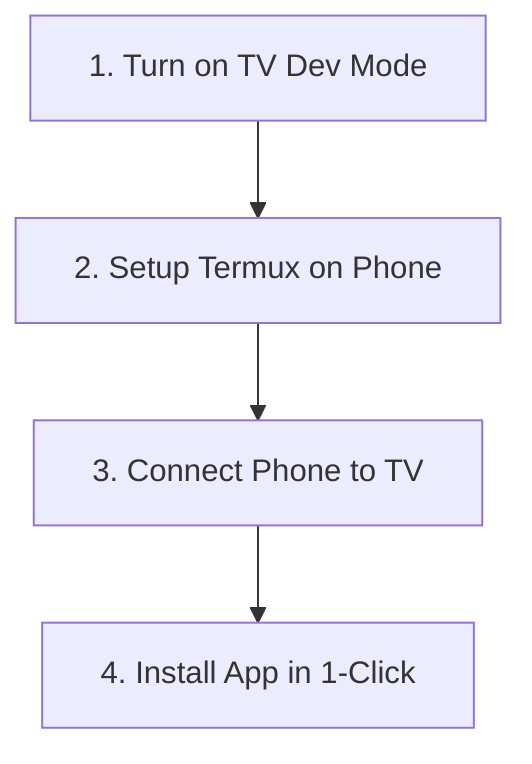

# 📺 Samsung TV Sideload Guide (For Absolute Beginners)

This guide helps you install custom apps (like Jellyfin, VLC, or Ad-Free YouTube) directly onto your Samsung Smart TV using **only your Android phone**! No computers, no USB flash drives, and no complex coding knowledge needed.

---

## 🗺️ How it Works (Simple Flow)



---

## 📺 Step 1: Turn on Developer Mode on Your TV

We need to tell your Samsung TV to allow app installations from your phone:

1. Turn on your TV, press the **Home** button on your remote, and open the **Apps** store.
2. Once the App Store is open, press the numbers **`1` `2` `3` `4` `5`** in order on your TV remote.
3. A hidden menu will pop up. Switch **Developer Mode** to **ON**.
4. You will see a box called **Host IP**. Type in your **Phone's Wi-Fi or Hotspot IP address** (you can find this in your phone's Wi-Fi Settings).
5. Press **OK** or **Submit**.
6. **Important:** Hold the **Power Button** on your TV remote down for 5 seconds until the TV turns off and turns back on with the Samsung logo. (This saves the settings).
7. Go to your TV **Network Settings** and write down your **TV's IP Address** (e.g., `10.187.217.145`).

---

## 🔐 Step 2: Set Up Termux on Your Phone

Open **Termux** on your Android phone and copy-paste these commands:

### 1. Set Up Security Permissions (Just Copy & Paste)
Copy and paste this line into Termux and press **Enter**. (This lets your TV trust your phone):
```bash
mkdir -p ~/.android ~/.tizen && [ -f ~/.tizen/sdbkey ] || adb keygen ~/.tizen/sdbkey 2>/dev/null; cp ~/.tizen/sdbkey ~/.android/adbkey && cp ~/.tizen/sdbkey.pub ~/.android/adbkey.pub
```

### 2. Download the Installer Tool
Copy and paste this command to download our automated installer script:
```bash
curl -L -o install.py https://raw.githubusercontent.com/Suz41/Sideload-Tizen-by-Android/main/install.py
```

---

## 🚀 Step 3: Install Your App!

### 1. Connect to Your TV
Type this command in Termux, replacing `<TV_IP>` with your TV's actual IP address from Step 1, then press **Enter**:
```bash
adb connect <TV_IP>:26101
```
*(Example: `adb connect 10.187.217.145:26101`)*

### 2. Download a TV App Package
For example, to download the **Jellyfin TV App**, copy and paste this command:
```bash
curl -L -o Jellyfin.wgt https://github.com/Apps2Samsung/tizen-community-packages/raw/main/Jellyfin.wgt
```

### 3. Sideload It onto the TV!
Run this command to send and install the app on your TV screen:
```bash
python3 install.py Jellyfin.wgt Jellyfin
```

---

## 📋 Popular TV Apps Directory

Use these names for Step 3:

| App Name | Download Command | Sideload Command |
| :--- | :--- | :--- |
| **🍿 Jellyfin TV** | `curl -L -o Jellyfin.wgt https://github.com/Apps2Samsung/tizen-community-packages/raw/main/Jellyfin.wgt` | `python3 install.py Jellyfin.wgt Jellyfin` |
| **🍺 Ad-Free YouTube** | `curl -L -o TizenBrew.wgt https://github.com/reisxd/TizenBrew/releases/latest/download/TizenBrewStandalone.wgt` | `python3 install.py TizenBrew.wgt xvvl3S1bvH.TizenBrewStandalone` |
| **🎬 VLC Player** | `curl -L -o vlctv.wgt https://github.com/Apps2Samsung/tizen-community-packages/raw/main/vlctv.wgt` | `python3 install.py vlctv.wgt VLCTV` |
