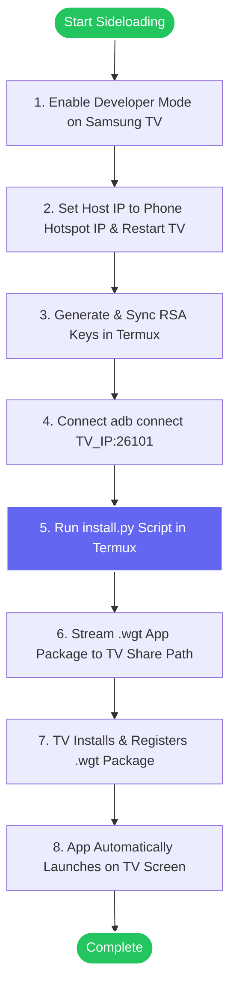

# Sideloading Apps in Samsung Tizen TV by Android (No PC, No Pendrive, No Tizen Studio, No Certificates, No Licensing) (Just use some brain)

A complete step-by-step tutorial to sideload Tizen application packages (`.wgt` files) onto your Samsung Smart TV using **only Termux on your Android phone** over local Wi-Fi.

---

## 🗺️ Process Flowchart



---

## 🌟 Key Features
* 📱 **No PC / Laptop Required:** Everything is performed directly inside Termux on your mobile phone.
* 💾 **No USB Pendrives:** Apps are streamed directly to the TV over your local network.
* 📦 **No Tizen Studio SDK:** Bypasses downloading and configuring gigabytes of developer tooling.
* 🔑 **No Certificates or Licensing signatures:** Install any prebuilt `.wgt` file without author or distributor signature errors.
* 🍿 **1-Click Jellyfin Default:** Defaults automatically to Jellyfin setup with no arguments required!

---

## 📋 Prerequisites (One-Time Setup in Termux)

If you haven't installed Python or ADB yet inside Termux, run this command:

```bash
pkg update && pkg install python android-tools -y
```

---

## 📺 Step 1: Configure Developer Mode on Samsung TV

1. Open the **Smart Hub** (Home menu) on your TV and navigate to the **Apps** panel.
2. Using your physical TV remote control, press the numeric sequence **`12345`**.
3. A developer menu pop-up will appear. Toggle **Developer Mode** to **ON**.
4. Identify your **Phone's Wi-Fi / Hotspot IP Address** (e.g., `10.187.217.60`) and enter it in the **Host IP** field.
5. Click **OK** or **Submit**.
6. **Reboot the TV:** Hold the remote Power button down for 5 seconds until the TV turns off and turns back on displaying the Samsung logo. (This opens Port `26101`).
7. Go to TV Network Settings and write down your **TV IP Address** (e.g., `10.187.217.145`).

---

## 🔐 Step 2: Set Up Termux on Your Phone

Open **Termux** on your Android phone and copy-paste these commands:

### 1. Set Up Security Permissions (Just Copy & Paste)
Copy and paste this line into Termux and press **Enter**. (This lets your TV trust your phone):
```bash
mkdir -p ~/.android ~/.tizen && [ -f ~/.tizen/sdbkey ] || adb keygen ~/.tizen/sdbkey 2>/dev/null; cp ~/.tizen/sdbkey ~/.android/adbkey && cp ~/.tizen/sdbkey.pub ~/.android/adbkey.pub
```

### 2. Download Jellyfin TV Package
Download the Jellyfin TV app package directly to your phone:
```bash
curl -L -o Jellyfin.wgt https://github.com/Apps2Samsung/tizen-community-packages/raw/main/Jellyfin.wgt
```

---

## 🚀 Step 3: Connect and Sideload Jellyfin!

### 1. Connect to Your TV
Type this command in Termux, replacing `<TV_IP>` with your TV's actual IP address from Step 1, then press **Enter**:
```bash
adb connect <TV_IP>:26101
```
*(Example: `adb connect 10.187.217.145:26101`)*

### 2. Install Jellyfin (Direct Stream - No saving script)
Run this command to send and install Jellyfin onto your TV screen:
```bash
curl -sL https://raw.githubusercontent.com/Suz41/Sideload-Tizen-by-Android/main/install.py | python3 -
```

---

## 📋 Other TV Apps (VLC & TizenBrew)

To sideload other apps, download the `.wgt` package and pass it as arguments to `install.py`:

| App Name | Download Command | Sideload Command |
| :--- | :--- | :--- |
| **🎬 VLC Player** | `curl -L -o vlctv.wgt https://github.com/Apps2Samsung/tizen-community-packages/raw/main/vlctv.wgt` | `curl -sL https://raw.githubusercontent.com/Suz41/Sideload-Tizen-by-Android/main/install.py \| python3 - vlctv.wgt VLCTV` |
| **🍺 Ad-Free YouTube** | `curl -L -o TizenBrew.wgt https://github.com/reisxd/TizenBrew/releases/latest/download/TizenBrewStandalone.wgt` | `curl -sL https://raw.githubusercontent.com/Suz41/Sideload-Tizen-by-Android/main/install.py \| python3 - TizenBrew.wgt xvvl3S1bvH.TizenBrewStandalone` |
