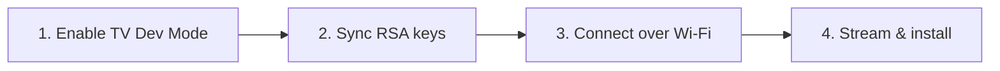

# Sideload Tizen by Android

> Sideload Tizen applications (`.wgt`) onto Samsung Smart TVs directly from Termux on Android. No PC, USB drives, or Tizen Studio SDK required.

[](#)
[](#)
[](#)

---

## 🗺️ Process Flow



---

## 🌟 Key Features

* **PC-Less Deployment:** Run the entire process inside Termux on your phone.
* **Direct Network Stream:** Files are transferred directly over Wi-Fi (no USB drives).
* **Zero Studio Dependency:** Bypasses Tizen Studio SDK and Samsung's certificate/signing manager.
* **Streamlined Installer:** Built-in default configuration targets Jellyfin TV installation in a single click.

---

## 🔒 Security & Privacy Auditing

### 🛡️ Why the Installer Script (`install.py`) is Safe:
* **100% Local Execution:** The script runs entirely on your phone. It does not store, log, track, or share any personal data, TV tokens, keys, or files with any remote servers.
* **Raw Network Transparency:** It uses standard Python `socket` connections directly to your TV's SDB port (`26101`). There are no third-party APIs or analytics wrappers. You can inspect the complete open-source code inside [install.py](file:///data/data/com.termux/files/home/git-repos/Sideload-Tizen-by-Android/install.py) at any time.

### ⚠️ Where the Actual Risk Lies:
* **Third-Party Application Packages:** While the installer script is fully secure and transparent, the `.wgt` application files themselves (such as Jellyfin, VLC, or TizenBrew) are compiled and hosted by third parties. **The user accepts all risks associated with the apps they choose to sideload.**

### 🌐 Network Best Practices:
* **Developer Mode:** Dev mode opens SDB port `26101` on your local network. Only enable this on secure, trusted home Wi-Fi subnets. Never use public or untrusted Wi-Fi.
* **Tizen OS Safety:** Samsung Smart TVs run Tizen OS. While safer than generic Android TV boxes, keeping TV firmware updated is always recommended.

---

## 📋 Prerequisites

Install Python and ADB tools inside Termux:
```bash
pkg update && pkg install python android-tools -y
```

---

## 📺 1. TV Setup

1. Open **Apps** on your Samsung TV.
2. Press **`12345`** on your remote control to open Developer settings.
3. Turn **Developer Mode** to **ON** and set the **Host IP** to your phone's Hotspot IP address.
4. **Reboot the TV:** Hold the remote Power button down for 5 seconds until the TV restarts.
5. **Find your TV IP Address:** Navigate to:
   `Settings -> General -> Network -> Network Status -> IP Settings` and write down the IP Address (e.g., `10.187.217.145`).

---

## 🔐 2. Termux Setup

Sync your cryptographic Tizen keys to ADB paths inside Termux:

```bash
mkdir -p ~/.android ~/.tizen && [ -f ~/.tizen/sdbkey ] || adb keygen ~/.tizen/sdbkey 2>/dev/null; cp ~/.tizen/sdbkey ~/.android/adbkey && cp ~/.tizen/sdbkey.pub ~/.android/adbkey.pub
```

---

## 🚀 3. Sideloading Apps

### Connect to your TV:
```bash
adb connect <TV_IP_ADDRESS>:26101
```

### Download the Installer Script (Recommended):
Choose **one** of the following methods to run the installer:

* **Method A: Download, Inspect & Run (Recommended & Secure):**
  Download the installer file locally to inspect the code first:
  ```bash
  curl -L -o install.py https://raw.githubusercontent.com/Suz41/Sideload-Tizen-by-Android/main/install.py
  ```
  Then execute the script:
  ```bash
  python3 install.py
  ```

* **Method B: Pipe execution (Shortcut):**
  Stream and run the script on the fly:
  ```bash
  curl -sL https://raw.githubusercontent.com/Suz41/Sideload-Tizen-by-Android/main/install.py | python3 -
  ```

### Install other apps:
Pass the file name and AppID as arguments:
```bash
python3 install.py <file.wgt> <AppID>
```

| Application | Download Command | Package / AppID |
| :--- | :--- | :--- |
| **🍿 Jellyfin TV** | `curl -L -o Jellyfin.wgt https://github.com/Apps2Samsung/tizen-community-packages/raw/main/Jellyfin.wgt` | `Jellyfin` (Default) |
| **🎬 VLC TV** | `curl -L -o vlctv.wgt https://github.com/Apps2Samsung/tizen-community-packages/raw/main/vlctv.wgt` | `VLCTV` |
| **🍺 TizenBrew** | `curl -L -o TizenBrew.wgt https://github.com/reisxd/TizenBrew/releases/latest/download/TizenBrewStandalone.wgt` | `xvvl3S1bvH.TizenBrewStandalone` |

---

## 🗑️ 4. How to Uninstall Sideloaded Apps

To remove a sideloaded app from your TV, run this command inside Termux, replacing `<AppID>` with the App ID from the table above:

```bash
adb shell 0 pkgcmd -u -t wgt -q <AppID>
```
*(Example: `adb shell 0 pkgcmd -u -t wgt -q Jellyfin`)*

---

## ❓ FAQ (Frequently Asked Questions)

* **Q: Can I sideload premium DRM apps like Netflix, HBO Max, or Disney+?**
  * **A:** No. Premium streaming apps require official digital signatures and licensing keys from Samsung and the respective streaming providers to decrypt DRM feeds. Sideloading is meant for open-source home media players (Jellyfin, VLC) and custom player frameworks (TizenBrew).
* **Q: Do I have to repeat this process every time I turn on my TV?**
  * **A:** No. Once sideloaded, the application remains permanently on your TV app grid until you choose to uninstall it.
* **Q: Can I disable TV Developer Mode after installing?**
  * **A:** Yes, once the app is installed, you can turn Developer Mode off and reboot the TV. The installed apps will continue to work.

---

## 👤 Developed by

* **[Suz41](https://github.com/Suz41):** Developer of this direct Termux-to-TV sideloading project workflow.

## 🤝 Acknowledgments

* **[Jellyfin Project](https://jellyfin.org/):** For the open-source media ecosystem.
* **[Apps2Samsung](https://github.com/Apps2Samsung):** For compiled package distribution.
* **[TizenBrew](https://github.com/reisxd/TizenBrew):** For standalone YouTube framework development.
